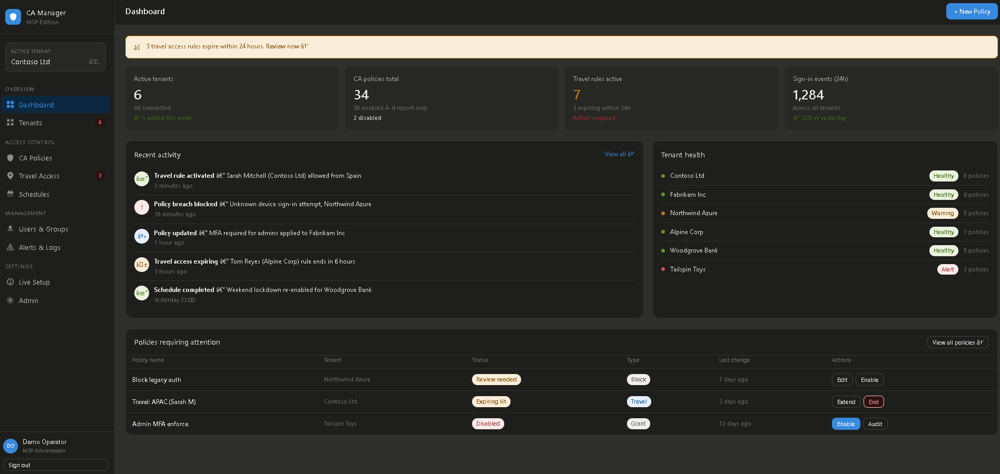
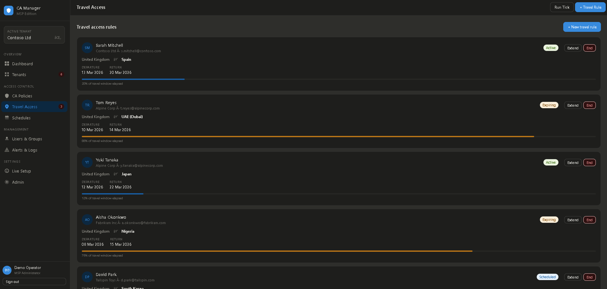

<p align="center">
  
</p>

# CA Manager - MSP Edition

A multi-tenant Azure Conditional Access management platform scaffold for MSP operations teams.




This repository is intentionally **demo-first** for whitelabel use:

- no live tenant credentials required by default
- built-in `kontoso.com` demo tenant and policies
- live Microsoft Graph mode is opt-in

---

## Quick start

```bash
npm install
npm run dev
```

Default local URL:

- `http://127.0.0.1:3000`

Docker quick start:

```bash
docker build -t entra-ca-manager:latest .
docker run --rm -p 3000:3000 --env-file .env entra-ca-manager:latest
```

Core endpoints:

- `GET /health`
- `GET /api/session`
- `POST /auth/local-login`
- `POST /auth/change-password`
- `GET /api/tenants`
- `GET /api/policies`
- `POST /api/policies` (create — live mode)
- `PATCH /api/policies/:id` (update — live mode)
- `DELETE /api/policies/:id` (delete — live mode)
- `GET /api/management/overview`
- `GET /api/management/reminders`
- `GET /api/management/reminders?sync=true` (sync only when calendar integration + live mode are enabled)
- `POST /api/onboarding/validate` (credential validation before enabling live mode)
- `GET /api/travel`
- `POST /api/travel`
- `POST /api/travel/tick` (evaluate and apply scheduled travel rules)
- `DELETE /api/travel/:id`
- `POST /api/travel/:id/extend`
- `GET /api/admin/users` (admin only)
- `POST /api/admin/users` (admin only)
- `POST /api/admin/users/:id/reset-password` (admin only)

---

## Validation commands

```bash
npm run check
npm run e2e:demo
npm run e2e:policies
npm run e2e:management
npm run e2e:calendar:live
npm run e2e:auth:hardening
npm run audit:verify
```

---

## Runtime modes

### Demo mode (default)

- `ENABLE_LIVE_GRAPH=false`
- uses built-in `kontoso.com` tenant/policies
- safe for demos, onboarding, and forks
- `ENABLE_SSO_LOGIN=false` keeps auth disabled for local/bootstrap testing

### Live mode (opt-in)

Set:

```env
ENABLE_LIVE_GRAPH=true
```

Then provide:

- app registration credentials (`AZURE_TENANT_ID`, `AZURE_CLIENT_ID`, `AZURE_CLIENT_SECRET`)
  **or**
- `GRAPH_ACCESS_TOKEN` + `AZURE_TENANT_ID`

### SSO + RBAC mode (recommended for production)

Set:

```env
ENABLE_SSO_LOGIN=true
SSO_CLIENT_ID=<entra-app-client-id>
SSO_CLIENT_SECRET=<entra-app-client-secret>
SSO_TENANT_ID=<your-tenant-id-or-common>
SSO_REDIRECT_URI=https://ca.yourmspdomain.com/auth/callback
AUTH_REQUIRE_GROUPS=true
AUTH_ADMIN_GROUP_IDS=<group-id-1>,<group-id-2>
AUTH_ANALYST_GROUP_IDS=<group-id-3>,<group-id-4>
```

Then users authenticate at `/login` and gain access based on Entra group membership:

- Admin role: onboarding/setup pages + admin dashboard
- Analyst role: day-to-day service desk operations pages
- SSO users must also exist in the local directory (directory guard)

### Local credential mode (optional)

Set:

```env
ENABLE_LOCAL_LOGIN=true
LOCAL_BOOTSTRAP_ADMIN_EMAIL=admin@kontoso.com
LOCAL_BOOTSTRAP_ADMIN_PASSWORD=ChangeMeNow123!
```

Then:

- first admin signs in with local credentials via `/login`
- first admin is forced to reset password before normal dashboard/API access
- admin provisions users in the **Admin** page
- each user can be set to `sso`, `local`, or `either`
- RBAC group selection is stored per user (`admins` / `analysts`)
- lockout policy defaults to `5 attempts / 15 minutes`, lock for `15 minutes`
- password reuse is blocked on local password changes/resets
- admin user updates/reset operations revoke existing sessions for that user

---

## Deploying

### Option A — Azure App Service (recommended)

1. Create an **App Service** (Linux, Node 18+ runtime)
2. Deploy from GitHub or a zip package
3. Add environment variables under **Configuration → Application settings**
4. Set a custom domain (e.g. `ca.yourmspdomain.com`) with a managed TLS certificate
5. Ensure the reverse proxy forwards `X-Forwarded-Proto: https` so HSTS and security headers apply correctly
6. Confirm `https://<your-fqdn>/login` loads and `GET /health` returns expected state

Minimum production environment variables:

```env
ENABLE_SSO_LOGIN=true
SSO_TENANT_ID=<entra-tenant-id>
SSO_CLIENT_ID=<app-client-id>
SSO_CLIENT_SECRET=<app-client-secret>
SSO_REDIRECT_URI=https://<your-fqdn>/auth/callback
SESSION_SECRET=<long-random-secret>
SESSION_COOKIE_SECURE=true
AUTH_REQUIRE_GROUPS=true
AUTH_ADMIN_GROUP_IDS=<entra-group-object-id>
AUTH_ANALYST_GROUP_IDS=<entra-group-object-id>
AUDIT_LOG_ENABLED=true
AUDIT_LOG_SECRET=<long-random-secret>
```

For multi-instance deployments, add Redis for shared session and rate-limit state:

```env
REDIS_ENABLED=true
REDIS_REQUIRED=true
REDIS_URL=rediss://<redis-endpoint>:6380
```

For secret management via managed identity:

```env
ENABLE_KEYVAULT_SECRETS=true
KEYVAULT_URL=https://<your-vault>.vault.azure.net/
KEYVAULT_SECRET_MAPPINGS=SESSION_SECRET=ca-session-secret,SSO_CLIENT_SECRET=ca-sso-client-secret
```

### Option B — Self-hosted (VM or on-prem)

1. Install Node.js 18+ and clone this repo
2. Set environment variables in your system service or process manager config
3. Run the app behind a reverse proxy (Nginx, IIS ARR, or Apache):
   - proxy `https://<fqdn>` → `http://localhost:3000`
   - enforce HTTPS only and forward `X-Forwarded-Proto: https`
4. Install a TLS certificate on the proxy
5. Start with `npm start` or manage via `systemd` / `pm2`

### Option C - Docker / containerized

Build and run with Docker:

```bash
docker build -t entra-ca-manager:latest .
docker run --name entra-ca-manager --detach \
  -p 3000:3000 \
  --env-file .env \
  -e NODE_ENV=production \
  -v entra_ca_data:/app/data \
  entra-ca-manager:latest
```

Or use Docker Compose:

```bash
docker compose up -d --build
```

To pass your environment settings with Compose:

```bash
docker compose --env-file .env up -d --build
```

Useful container commands:

```bash
docker compose logs -f
docker compose ps
docker compose down
```

For a full container runbook (production env vars, persistence, updates, troubleshooting), see [`docs/docker-deployment-guide.md`](docs/docker-deployment-guide.md).

### First sign-in

The bootstrap admin is forced to reset its password on first sign-in before accessing any dashboard pages. Set the bootstrap credentials in your environment before first boot:

```env
ENABLE_LOCAL_LOGIN=true
LOCAL_BOOTSTRAP_ADMIN_EMAIL=admin@yourdomain.com
LOCAL_BOOTSTRAP_ADMIN_PASSWORD=ChangeMeNow123!
```

See [`docs/admin-deployment-guide.md`](docs/admin-deployment-guide.md) for the full walkthrough including Entra app registration, RBAC group setup, user provisioning, and post-deployment validation.

---

## Calendar integration (Outlook via Graph)

Calendar reminders are optional and disabled by default.

Enable:

```env
ENABLE_CALENDAR_INTEGRATION=true
CALENDAR_TARGET_USER=manager@yourdomain.com
```

Then call:

- `GET /api/management/reminders?sync=true`

The route will:

1. read policy state
2. build reminder plan
3. create reminder events in the target Outlook calendar (live mode only)

---

## Environment variables

See `.env.example` for full list.

Important groups:

- Graph runtime:
  - `GRAPH_API_BASE`
  - `GRAPH_SCOPE`
  - `GRAPH_REQUEST_TIMEOUT_MS`
  - `GRAPH_MAX_RETRIES`
- Distributed/session runtime (optional):
  - `REDIS_ENABLED`
  - `REDIS_URL`
  - `REDIS_REQUIRED`
  - `REDIS_KEY_PREFIX`
- Calendar runtime:
  - `ENABLE_CALENDAR_INTEGRATION`
  - `CALENDAR_TARGET_USER`
  - `CALENDAR_TIMEZONE`
  - `CALENDAR_STANDARD_REVIEW_DAYS`
  - `CALENDAR_REPORT_ONLY_REVIEW_DAYS`
  - `CALENDAR_DISABLED_REVIEW_DAYS`
- Audit/security runtime:
  - `AUDIT_LOG_ENABLED`
  - `AUDIT_LOG_FILE`
  - `AUDIT_LOG_SECRET`
- Key Vault runtime (optional):
  - `ENABLE_KEYVAULT_SECRETS`
  - `KEYVAULT_URL`
  - `KEYVAULT_SECRET_MAPPINGS`
  - `KEYVAULT_OVERRIDE_EXISTING`

---

## Documentation for operations teams

- `docs/service-desk-analyst-runbook.md`
- `docs/admin-deployment-guide.md`
- `docs/docker-deployment-guide.md`
- `docs/calendar-integration-plan.md`
- `docs/tenant-setup.md`
- `docs/architecture.md`
- `docs/public-release-checklist.md`
- `SECURITY.md`
- `docs/incident-response.md`
- `docs/threat-model.md`
- `docs/keyvault-rotation-runbook.md`
- [`docs/rds-remoteapp-deployment-guide.md`](docs/rds-remoteapp-deployment-guide.md)
- `graph-permissions.md`

---

## Roadmap

- [x] Node scaffold + API baseline
- [x] MSAL client-credential auth flow
- [x] Policy response mapping layer
- [x] Demo-first whitelabel defaults (`kontoso.com`)
- [x] Management overview + reminder planning
- [x] Optional Outlook calendar reminder sync (Graph)
- [x] Live onboarding UX and credential validation workflow
- [x] Duplicate-safe idempotent calendar sync
- [x] Travel-rule scheduler with live Graph patching
- [x] Policy CRUD wired to Graph API
- [x] SSO + local auth with RBAC, lockout, and session management
- [x] Tamper-aware audit logging chain
- [x] Redis session store support (optional)
- [x] Azure Key Vault secret hydration (optional)

---

## License

MIT
